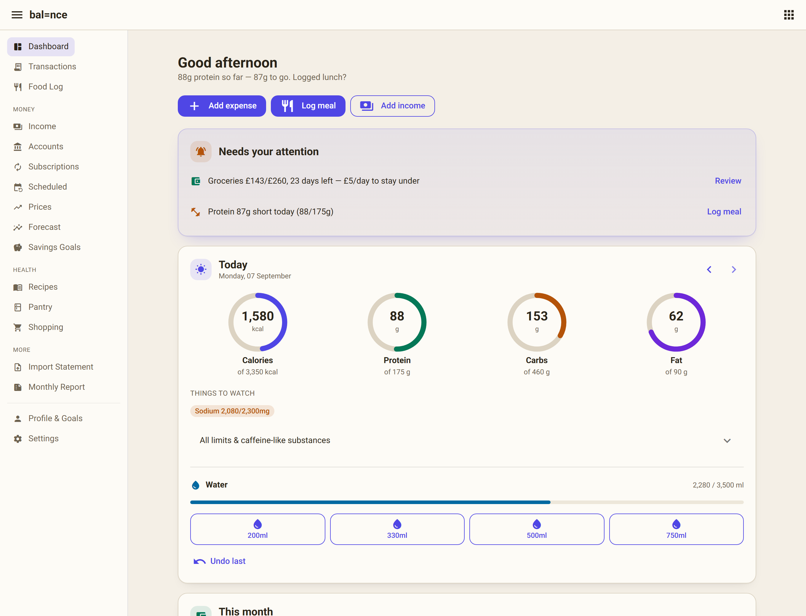
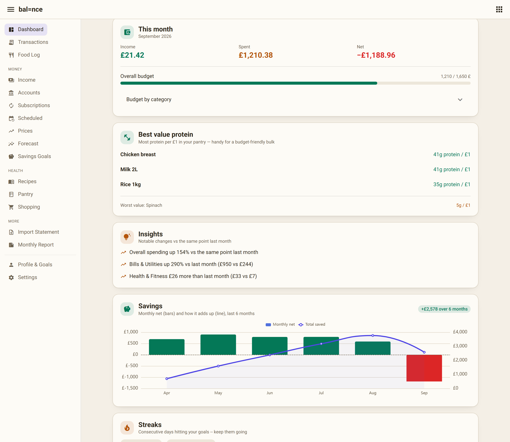
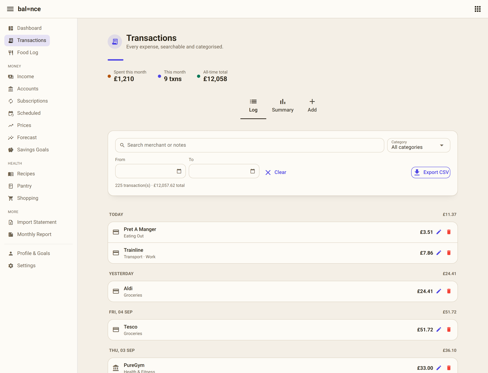
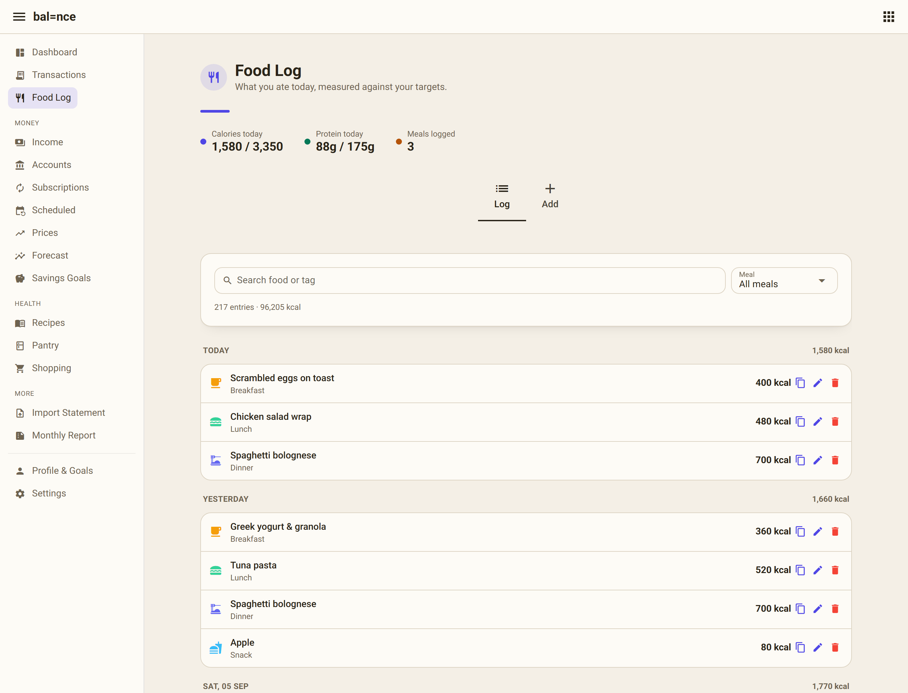
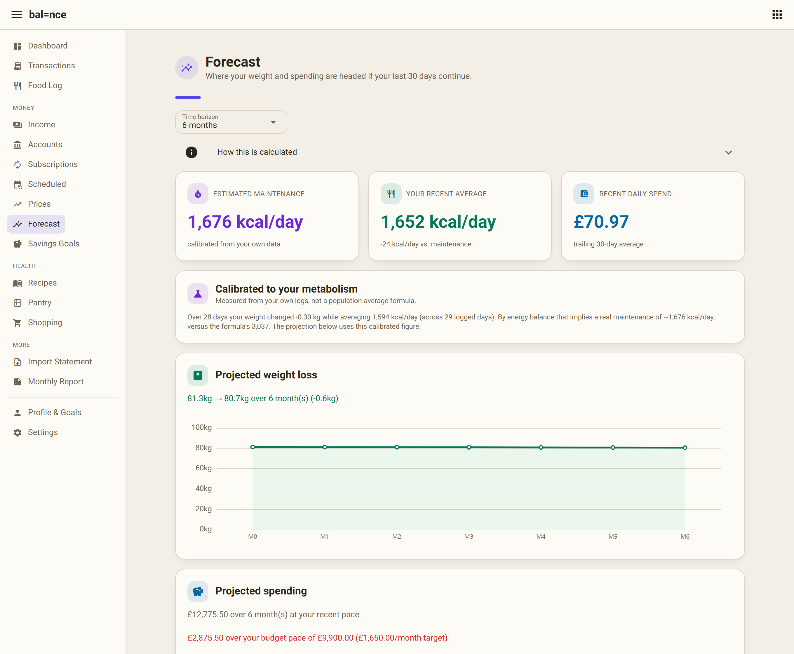
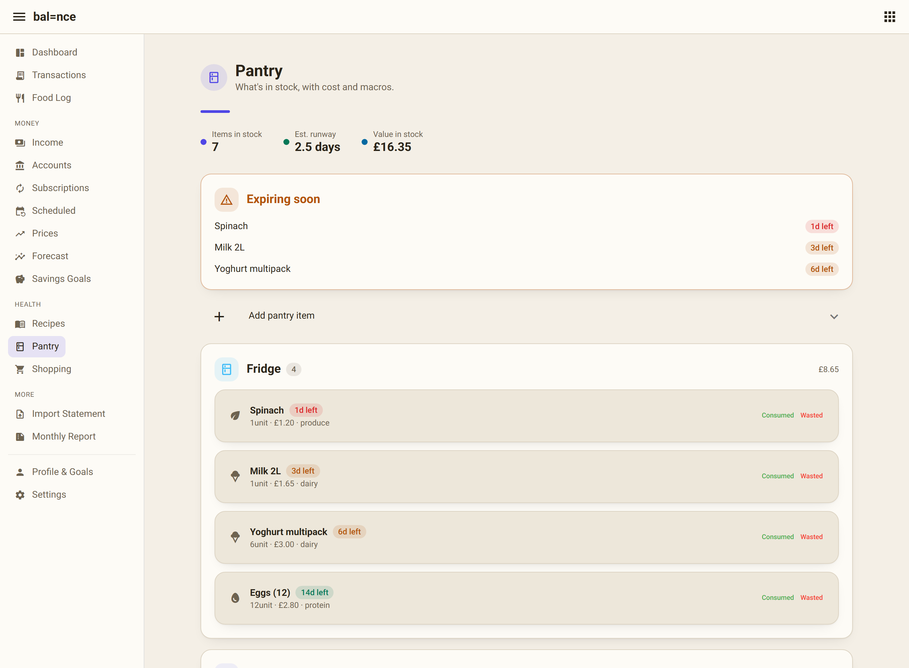

# Balance

**Track what you spend *and* what it does to your body — in one place.**

Balance is a self-hosted personal tracker that unifies expense tracking and
nutrition tracking, because the two are the same daily decisions seen from
different angles: the coffee is £3.10 *and* 120 kcal; the weekly shop is a
budget line *and* a week of meals. Most apps do one side well and ignore the
other. Balance sits on the intersection.

It's a single-process **FastAPI + SQLModel + SQLite + NiceGUI** app I built and
self-host — running as a background service and reachable from my phone over
Tailscale as an installable PWA.




---

## Why it's built this way

The design turns on one idea — **the money × health intersection** — and that
premise is used as a filter for what belongs in the product:

- **Cost-per-macro.** Balance ranks your pantry by *protein per £*, so "eat well
  on a budget" becomes a number instead of a vibe.
- **Eating out, costed both ways.** Log a meal out and it records the £ *and* the
  kcal in one entry.
- **Everything else earns its place.** Single-sided features (net worth, price
  tracking, recipes, forecasting…) are **optional modules, off by default** — a
  fresh install is deliberately lean, and you switch on what you want in
  Settings.

It's **local-first and single-user by design**: your combined financial + health
data never leaves your machine — no accounts, no cloud, no telemetry.

---

## Screenshots

> Rendered with generated demo data — no real personal finances shown.

| | |
|---|---|
| **Dashboard** — time-aware greeting, "needs your attention" nudges, ring gauges for calories & macros, live budget burn-down. | **Money × health** — cost-per-macro ranking, computed month-over-month insights, and a savings chart with a cumulative "total saved" line. |
|  |  |
| **Transactions** — searchable, categorised, CSV export, per-row context tags. | **Food Log** — meals against your daily targets, macros, barcode lookup. |
|  |  |
| **Forecast** — TDEE *calibrated from your own weight + intake history*, not a population formula. | **Pantry** — stock with cost + macros, expiry alerts, waste tracking. |
|  |  |

---

## Highlights I'm proud of

- **Metabolism calibrated from your own data.** The forecast starts from
  Mifflin-St Jeor, but once there's enough logged weight + intake it solves the
  energy-balance identity (`TDEE = avg_intake − ΔW·7700/days`) to report your
  *actual* maintenance calories — a real measurement from your history, with the
  assumptions stated in plain English rather than hidden.
- **Bank-statement import** (CSV + PDF) with per-row auto-categorisation
  (merchant-history → UK-merchant keyword map), duplicate detection, and a
  one-click undo — nothing is written until you review and confirm.
- **A feature-flag module system.** A registry + persisted overrides drive the
  nav and route guards, with a one-time backfill so upgrading an existing
  install never hides a section while fresh installs stay lean.
- **Zero-downtime schema evolution.** A lightweight auto-migration adds new
  model columns on startup, so the single SQLite file upgrades in place.
- **A considered design system.** One theme (light/dark, system-aware), a shared
  page-header + summary-strip + card language, ring-gauge dashboards, and a PWA
  manifest so it installs to a phone home screen.

## Features at a glance

- **Dashboard** — verb-driven nudges (budget pace, protein gap, subs due),
  ring gauges, water logging, month income/spend/net with budget bars, savings
  trend, computed insights, habit streaks.
- **Transactions & Income** — add/edit/delete, search + filter, CSV export,
  context tags, spend/income trend and category charts.
- **Food Log** — macros + micros, Open Food Facts barcode lookup, an "eaten out"
  toggle that logs the meal *and* the spend in one action.
- **Pantry / Recipes / Shopping** — stock with cost + macros, expiry & waste
  tracking, recipes costed per serving, a shopping list wired to both.
- **Subscriptions & Scheduled** — recurring spend normalised to a monthly total,
  auto-detection of untracked recurring payments, forward cashflow.
- **Profile & Goals** — profile-driven targets with a just-in-time estimator,
  weight trend with smoothing, budgets, one-file JSON backup.
- **Settings** — currency, category management, per-module toggles, an optional
  per-session PIN lock.

## Tech stack

| Layer | Choice |
|---|---|
| API | FastAPI + Uvicorn |
| Data | SQLModel over SQLite (WAL, in-process daily backups) |
| UI | NiceGUI (Quasar/Vue under the hood), ECharts for charts |
| Integrations | Open Food Facts (barcodes), pypdf (statement parsing) |
| Packaging | Docker + Compose; runs as a Windows (NSSM) or Linux (systemd) service |
| Tests | pytest — feature, core-logic, and theme suites |

## Architecture

- **One process, one port, one file.** `run.py` serves the JSON API and the web
  UI together; all state lives in a single `data/app.db`.
- **UI reads the database directly** via SQLModel sessions rather than making
  HTTP calls back to its own API — same process, so it skips pointless network
  round-trips. The REST API (`/docs`) shares the models and is there to script
  against.
- **Local-first privacy model.** The app has no login; **the network is the
  boundary.** `run.py` binds `127.0.0.1` and Tailscale fronts it, so it's
  reachable only from your own devices and simply doesn't exist to the public
  internet. (Full reasoning in [`DEPLOY.md`](DEPLOY.md).)

## Run it locally

```bash
git clone <your-repo-url> balance
cd balance
python -m venv venv
venv\Scripts\activate          # Windows  (source venv/bin/activate on macOS/Linux)
pip install -r requirements.txt
python run.py
```

Then open **http://localhost:8000** (API docs at **/docs**).

Or with Docker:

```bash
docker compose up -d
```

Full self-hosting guide — Docker, Windows/Linux services, Tailscale HTTPS, and
installing as a phone PWA — is in **[`DEPLOY.md`](DEPLOY.md)**.

## Tests

```bash
pytest
```

## Status

A personal project I actively use and self-host — single-user by design. It's
not a product with other users, and it's shared here as a portfolio piece. The
combined finance + health data model is deliberately kept local-first rather than
built into a multi-user hosted service.
